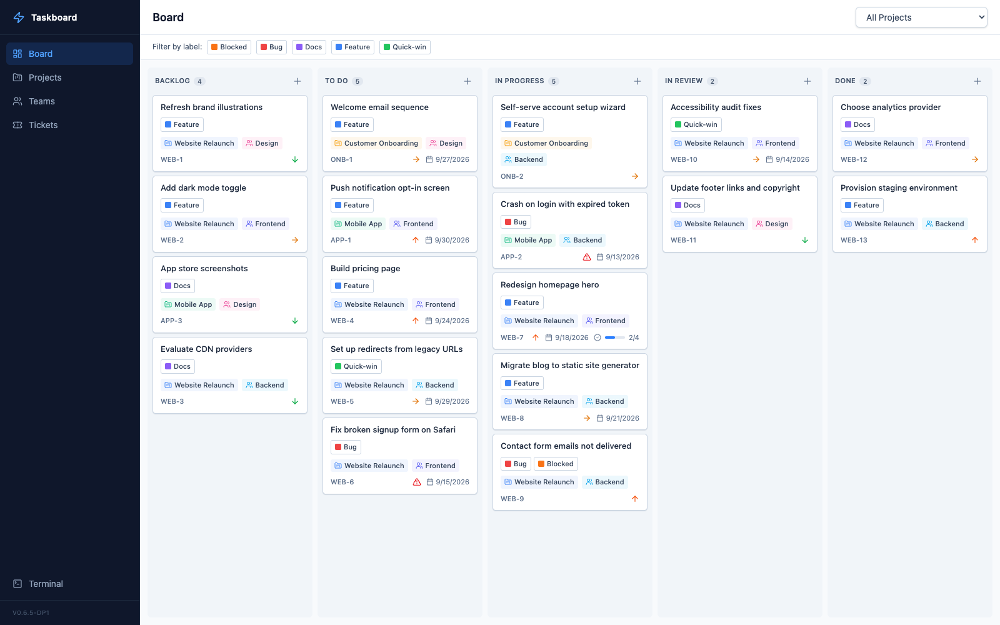
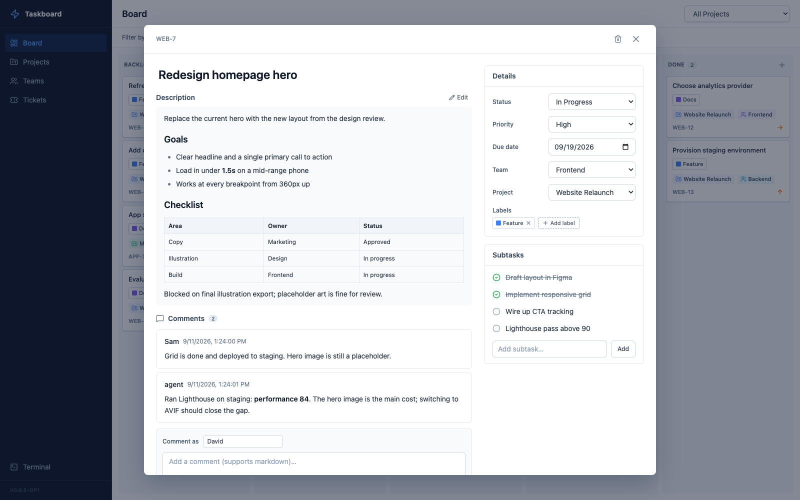
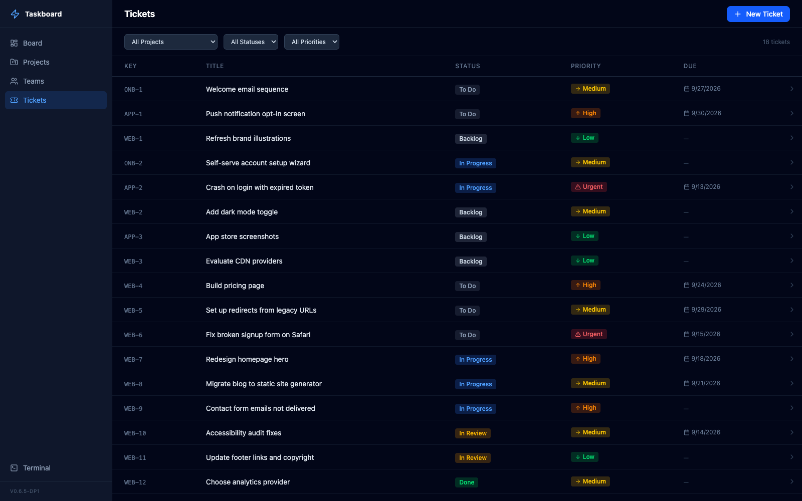
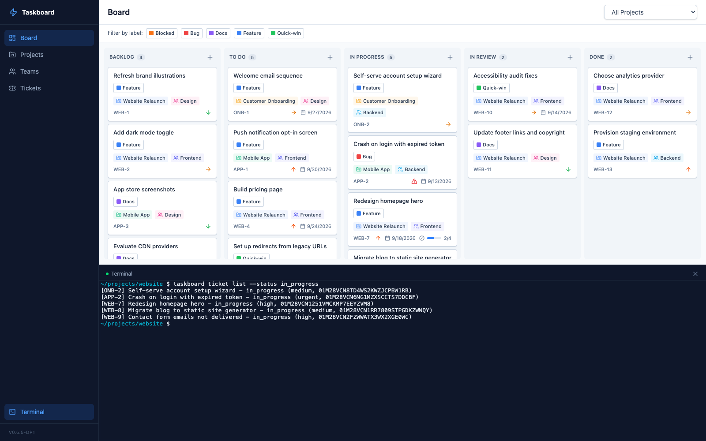

# Taskboard

A local, self-hosted Kanban board with a web UI, a scriptable CLI, and a built-in
[MCP](https://modelcontextprotocol.io/) server, so you and your AI assistants work
from the same board.

Single binary. SQLite-backed. No Docker, no external database, no runtime dependencies.

> **Fork note:** this is an independent fork of
> [tcarac/taskboard](https://github.com/tcarac/taskboard) (MIT, see `LICENSE`), forked
> at v0.6.0 and no longer tracking upstream. It adds a five-column board, labels, a
> Jira-style ticket view with Markdown and comments, cross-project ticket moves, and a
> CLI with full JSON output. Versions are tagged `vX.Y.Z-dpN`.

## Screenshots







## Features

- **Five-column board**: Backlog, To Do, In Progress, In Review, Done, with drag-and-drop
- **Ticket view**: a wide modal with a rendered Markdown description (tables, task lists),
  details panel, subtasks, and comments. It refreshes live, so edits an agent makes appear
  while the ticket is open
- **Comments**: Markdown comments with an author, from the UI, CLI, or MCP
- **Labels**: colour-coded tags with a board filter
- **Projects and teams**: projects have an icon, colour, and key prefix (`WEB-12`); tickets
  can be moved between projects, and deleting a project asks for confirmation first
- **Tickets**: priority, due date, team, labels, subtasks, and blocked-by dependencies
- **Embedded terminal**: a full shell in the web UI for running Claude Code, opencode,
  or anything else
- **CLI**: every data operation, with `--json` output for scripts and agents
- **MCP server**: 26 tools for AI-native project management
- **Local**: your data stays on your machine in one SQLite file

## Install

Requires Go 1.24+ and Node.js 22+.

```bash
git clone https://github.com/davidpetesich-byte/taskboard.git
cd taskboard
make install          # builds the frontend and binary, installs to ~/.local/bin/taskboard
```

Make sure `~/.local/bin` is on your `PATH`:

```bash
export PATH="$HOME/.local/bin:$PATH"
which taskboard       # expected: ~/.local/bin/taskboard
```

To upgrade, `git pull` and run `make install` again, then `taskboard stop && taskboard start`.
Running MCP sessions keep the old binary until they restart.

> If you previously installed upstream Taskboard with Homebrew, run
> `brew uninstall taskboard` first. Otherwise the two binaries shadow each other and
> share the same database and PID file.

## Usage

### Web UI

```bash
taskboard start               # runs in the background at http://localhost:3010
taskboard start --port 8080
taskboard start --foreground  # stay attached to the terminal
taskboard stop
```

### CLI (for scripts and agents)

The data-management commands shown below accept `--json`. Commands that return data emit
API model objects; `list` commands emit arrays (`[]` when empty). Delete commands emit the
CLI confirmation object `{"deleted":true,"id":"..."}`. Errors go to stderr with a non-zero
exit code. Lifecycle and protocol commands (`start`, `stop`, `mcp`, and `clear`) are outside
this JSON contract.

Tickets may be referenced by ID or by display key (`WEB-12`); labels by ID or by an
unambiguous, case-insensitive name. If more than one label has the same name, the command
errors and requires a label ID. Due dates must use `YYYY-MM-DD`.
Optional fields that are empty (`description`, `labels`, `subtasks`, `comments`, `blockedBy`,
`dueDate`, `teamId`) are omitted from the JSON rather than emitted as empty values, so treat
a missing key as empty.

| Command | Purpose |
|---|---|
| `taskboard board [--project ID]` | All five columns with their tickets |
| `taskboard ticket list [--project ID] [--team ID] [--status S] [--priority P] [--label REF]` | List tickets |
| `taskboard ticket get REF` | Full ticket: description, labels, subtasks, comments, blockers |
| `taskboard ticket create --project ID --title T [--status S] [--priority P] [--due YYYY-MM-DD] [--team ID] [--description MD \| --description-file PATH\|-] [--label REF]...` | Create a ticket |
| `taskboard ticket update REF [--title T] [--status S] [--priority P] [--due YYYY-MM-DD] [--team ID] [--project ID\|PREFIX] [--description MD \| --description-file PATH\|-] [[--label REF]... \| [--add-label REF]... [--remove-label REF]... \| --clear-labels]` | Update only the fields given |
| `taskboard ticket move REF --status S` | Change status |
| `taskboard ticket delete REF` | Delete a ticket |
| `taskboard label list` / `label create NAME [--color '#RRGGBB']` / `label delete REF` | Manage labels |
| `taskboard subtask add TICKET-REF TITLE` / `subtask toggle ID` / `subtask delete ID` | Manage subtasks |
| `taskboard comment add TICKET-REF BODY` / `--body-file -` / `comment list TICKET-REF` / `comment delete ID` | Manage comments (`--author` defaults to `cli`) |
| `taskboard project list` / `project create NAME --prefix P [--icon EMOJI] [--color '#RRGGBB']` / `project delete ID` | Manage projects |
| `taskboard team list` / `team create NAME [--color '#RRGGBB']` / `team delete ID` | Manage teams |

For `ticket update`, one or more repeated `--label REF` flags collectively replace the
entire label set. Repeated `--add-label REF` and `--remove-label REF` flags apply deltas to
the current set; `--clear-labels` empties it. Replace, delta, and clear modes cannot be mixed.

`--project` on `ticket update` moves the ticket to another project. The ticket is
renumbered in the target project, so its display key changes (`WEB-7` might become
`APP-4`) and the old key stops resolving.

Statuses: `backlog`, `todo`, `in_progress`, `in_review`, `done`. Priorities: `urgent`,
`high`, `medium`, `low`. Example:

```bash
taskboard --json ticket get WEB-7 | jq .status
printf '# Plan\n\n- step one\n' | taskboard ticket update WEB-7 --description-file - --add-label Blocked
taskboard comment add WEB-7 "Deployed to staging; ready for review."
```

### MCP server (for AI assistants)

```bash
taskboard mcp    # JSON-RPC over stdio
```

#### Claude Code

```bash
claude mcp add taskboard -- ~/.local/bin/taskboard mcp
```

#### Claude Desktop

Add to `~/Library/Application Support/Claude/claude_desktop_config.json`, using the
absolute path to the binary:

```json
{
  "mcpServers": {
    "taskboard": {
      "command": "/Users/you/.local/bin/taskboard",
      "args": ["mcp"]
    }
  }
}
```

#### Data hierarchy

```
Project → Ticket → Subtask
(initiative)  (task)    (step)
```

- **Projects** are the top-level grouping (like epics/initiatives). Create one per body of work.
- **Tickets** are concrete, actionable tasks within a project. Don't create "epic" tickets; use projects.
- **Subtasks** are checklist steps within a ticket, for breaking work into verifiable pieces.
- **Comments** record what was looked at and found, without rewriting the description.

#### Available MCP tools (26)

| Tool                    | Description                                              |
| ----------------------- | -------------------------------------------------------- |
| **Projects**            |                                                          |
| `list_projects`         | List all projects with optional status filter            |
| `get_project`           | Get project details by ID                                |
| `create_project`        | Create a new project (use for epics/initiatives)         |
| `update_project`        | Update project properties                                |
| `delete_project`        | Delete a project and all its tickets                     |
| **Teams**               |                                                          |
| `list_teams`            | List all teams                                           |
| `get_team`              | Get team details by ID                                   |
| `create_team`           | Create a new team                                        |
| `update_team`           | Update team properties                                   |
| `delete_team`           | Delete a team                                            |
| **Tickets**             |                                                          |
| `list_tickets`          | List tickets with filters                                |
| `get_ticket`            | Get a ticket with subtasks, labels, and comments         |
| `create_ticket`         | Create a ticket (task) within a project                  |
| `update_ticket`         | Update ticket properties, or move it to another project  |
| `move_ticket`           | Move a ticket to a different status column               |
| `delete_ticket`         | Delete a ticket                                          |
| **Labels**              |                                                          |
| `list_labels`           | List all labels                                          |
| `create_label`          | Create a label (name, hex color)                         |
| `delete_label`          | Delete a label and detach it from all tickets            |
| **Board**               |                                                          |
| `get_board`             | Get the full Kanban board grouped by status              |
| **Subtasks**            |                                                          |
| `create_subtask`        | Add a subtask to a ticket                                |
| `batch_create_subtasks` | Add multiple subtasks to a ticket at once                |
| `toggle_subtask`        | Toggle subtask completion                                |
| `delete_subtask`        | Remove a subtask from a ticket                           |
| **Comments**            |                                                          |
| `add_comment`           | Add a Markdown comment (default author `agent`)          |
| `delete_comment`        | Remove a comment                                         |

#### Example prompts

Once the MCP server is connected, you can talk to your AI assistant in high-level terms
and let it work out the breakdown:

```
I'm relaunching our marketing site. Set up a project and break the work into
tickets covering the homepage, pricing page, blog migration, and redirects.
Prioritize accordingly.
```

```
Look at my board and figure out what's blocking progress. If anything in
"In Progress" has no subtasks, break it down into concrete next steps.
```

```
Review WEB-7, check the staging site, and leave a comment with what you found.
Move it to In Review if it's ready.
```

### Embedded terminal

Click **Terminal** in the sidebar to open a full shell under the board, with colour
support and a resizable panel. Run `claude`, `opencode`, or any command from the browser.
Agents share the same SQLite database, so tickets they create or update show up on the
board immediately.



## Data storage

All data is stored in a SQLite database at:

- **macOS**: `~/Library/Application Support/taskboard/taskboard.db`
- **Linux**: `~/.config/taskboard/taskboard.db`

Migrations run automatically on first start. To back up, stop the server and copy the file.

### Custom database path

Use `--db` to point any command at a different database file:

```bash
taskboard --db /path/to/other.db start
taskboard --db /path/to/other.db mcp
taskboard --db /path/to/other.db ticket list
```

### Clearing data

To wipe all projects, tickets, teams, and labels while keeping the schema intact:

```bash
taskboard clear        # prompts for confirmation
taskboard clear -f     # skip confirmation
```

This also respects `--db`, so you can clear a specific database file:

```bash
taskboard --db /tmp/test.db clear -f
```

## Tech stack

| Layer        | Technology                                                    |
| ------------ | ------------------------------------------------------------- |
| Language     | Go                                                            |
| Database     | SQLite (via modernc.org/sqlite, pure Go)                      |
| CLI          | cobra                                                         |
| HTTP         | chi                                                           |
| Frontend     | React 19, TypeScript, Vite, Tailwind CSS v4, dnd-kit          |
| Markdown     | react-markdown, remark-gfm                                    |
| Terminal     | xterm.js, gorilla/websocket, creack/pty                       |
| MCP          | JSON-RPC over stdio                                           |
| Distribution | Single binary with embedded frontend via `embed.FS`           |

## Development

```bash
make dev            # backend in the foreground on :3010
make dev-frontend   # Vite dev server, proxies the API to :3010
make test           # Go tests
make build          # frontend + binary (./taskboard)
make install        # build and install to ~/.local/bin
make clean
```

## Contributing

See [CONTRIBUTING.md](CONTRIBUTING.md) for guidelines.

## License

[MIT](LICENSE)
